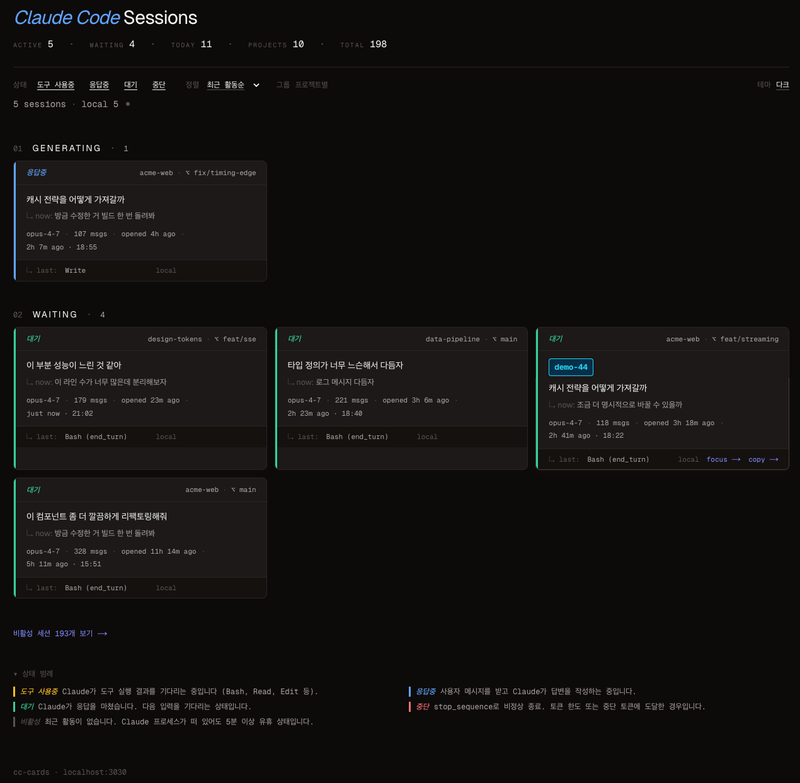

# cc-cards

[English](./README.md) · **한국어**

> `~/.claude`와 `~/.ccs/instances/*`의 Claude Code 세션을 카드 형태로 보여주는 로컬 모니터.

`cc-cards`는 `localhost:3030`에서 동작하는 단일 Next.js 앱입니다. 이 머신에서 도는 모든 Claude Code 세션 — 로컬과 `ccs` 인스턴스 — 을 한 화면의 카드 그리드로 보여줍니다.

한눈에 알 수 있는 정보:

- 어떤 세션이 **도구 사용중**, **응답중**, **대기**, **중단** 상태인지
- 각 세션이 무엇에 관한 것인지 (프로젝트, 브랜치, 모델, 첫 프롬프트, 마지막 프롬프트)
- 얼마나 오래 열려 있었는지, 마지막으로 움직인 시각

카드는 디스크의 JSONL이 변경될 때마다 Server-Sent Events로 실시간 갱신됩니다.

<p align="center">
  
  &nbsp;
  
  <br>
  <sub><em>왼쪽 라이트 · 오른쪽 다크 — <code>?demo=1</code> 모드 화면이며 프로젝트/브랜치/프롬프트 텍스트는 모두 placeholder입니다.</em></sub>
</p>

## 빠른 시작

```sh
npm install
npm run dev
# 브라우저에서 http://127.0.0.1:3030 열기
```

서버는 `127.0.0.1`에만 바인딩됩니다 — 외부 네트워크에서 접근할 수 없습니다.

## 주요 기능

- **5상태 분류**, 디스크 상태만으로 판정 — Claude Code 프로세스를 폴링하지 않습니다.
- **실시간 업데이트** SSE + `fs.watch(recursive: true)` 기반.
- **Focus → 터미널 점프.** 카드의 `focus →` 버튼을 누르면 해당 tmux pane을 선택하고 터미널 앱 (현재 Ghostty 지원) 을 활성화합니다.
- **`/rename` 통합.** 세션 안에서 `/rename`으로 붙인 이름이 cyan custom-title chip으로 표시됩니다.
- **본문 2줄.** 식별 라인 (custom title 또는 첫 프롬프트) + 마지막 프롬프트가 다르면 "↳ now:" 라인.
- **세션 디테일 페이지** — 타임라인, 토큰/메시지 통계, 도구 사용 분포.
- **아카이브 페이지** — 비활성 세션 별도 보기.
- **데모 (스크린샷 안전) 모드** — `?demo=1` 붙이면 프로젝트명/브랜치/프롬프트가 결정적 더미로 치환됩니다.

## 읽는 경로

| 경로                                              | 분류           |
| ------------------------------------------------- | -------------- |
| `~/.claude/projects/<encoded>/<UUID>.jsonl`       | `local`        |
| `~/.ccs/instances/<name>/projects/...`            | `ccs:<name>`   |

각 프로젝트 디렉토리의 `sessions-index.json` (존재할 때) 이 캐시된 summary / 메시지 카운트 / 첫 프롬프트를 제공합니다. 인덱싱되지 않은 세션은 JSONL 파일을 한 번만 풀스캔 (최대 4 MB 제한) 해서 같은 필드를 추출합니다.

같은 물리 디렉토리를 가리키는 symlink 루트는 `realpath`로 dedupe 됩니다. `ccs` 인스턴스의 `projects/`가 `~/.claude/projects/`로 symlink된 경우 중복 카운트되지 않습니다.

## 상태 분류

세션 상태는 디스크 상태에서 유도됩니다:

| 상태                    | 규칙 (요약) |
| ----------------------- | ----------- |
| **도구 사용중**         | 마지막 의미있는 assistant 항목이 `stop_reason: "tool_use"`로 끝났고 사이드카 `<UUID>/` 디렉토리가 최근에 변경됨. |
| **응답중**              | 가장 최근 항목이 user 메시지고 JSONL이 아직 쓰이고 있음. |
| **대기**                | 마지막 항목이 `end_turn`으로 끝난 assistant 메시지이고 mtime이 최근. |
| **중단**                | 마지막 assistant 메시지가 `stop_sequence`로 종료 (토큰 한도 또는 중단 토큰). |
| **비활성**              | 최근 활동 없음 (기본: 30분 초과). 위 조건 무시. |

메타 항목 (`last-prompt`, `permission-mode`, `attachment`, `file-history-snapshot`, `system`) 은 "마지막 의미있는 항목" 판정 시 skip 됩니다. 플랜 모드 훅이나 SessionStart 훅이 분류를 흔들지 않습니다.

## URL 상태

필터, 정렬, 그룹, 데모 상태가 query string에서 읽힙니다. 모든 화면을 북마크 가능합니다:

| 파라미터  | 값                                                                                                                                          |
| --------- | ------------------------------------------------------------------------------------------------------------------------------------------- |
| `status`  | `working_tool`, `working_generating`, `waiting`, `stopped`, `inactive` 의 콤마 구분 부분집합                                                |
| `sort`    | `activity-desc` (기본), `activity-asc`, `opened-desc`, `opened-asc`                                                                          |
| `group`   | `project` 지정 시 프로젝트별 (`cwd` basename) 그룹. 미지정 시 상태별 그룹                                                                    |
| `demo`    | `1` 지정 시 데모/스크린샷 안전 모드 (프로젝트/브랜치/프롬프트를 결정적 placeholder로 치환, SSE overlay 비활성)                              |

예시:

- `/?status=working_tool,working_generating,waiting` — 중단/비활성 숨김
- `/?group=project&sort=opened-desc` — 프로젝트별 + 최근 오픈순
- `/?demo=1` — 마스킹된 안전 뷰
- `/archive?demo=1` — 마스킹된 아카이브

## 데모 / 스크린샷 안전 모드

카드는 평소 실제 `cwd`, 브랜치, 프롬프트 텍스트를 노출합니다. README나 블로그 글에 스크린샷을 올릴 때는 `?demo=1`을 붙이세요:

- 프로젝트명, git 브랜치, 첫/마지막 프롬프트, custom title, JSONL 경로가 세션 id 해시 기반 placeholder로 치환됩니다 (같은 카드는 항상 같은 가짜 콘텐츠를 보여줍니다).
- 이 모드에서는 SSE overlay가 꺼져서 placeholder가 라이브 패치로 덮어쓰이지 않습니다.
- 헤더 위에 작은 "DEMO MODE" 배너 + "turn off →" 링크가 표시됩니다.

## Focus → 터미널

카드의 `focus →` 버튼은 해당 세션이 도는 터미널로 점프합니다:

1. `cwd`가 카드 프로젝트 경로와 일치하는 `claude` 프로세스를 찾습니다.
2. 그 PID의 ancestor chain을 따라가 tmux pane과 매칭합니다 (`tmux list-panes -a`가 PID 포함).
3. `tmux select-window` + `tmux select-pane`으로 점프합니다.
4. AppleScript로 터미널 앱 (Ghostty) 을 활성화해 tmux pane을 화면에 띄웁니다.

세션이 실제로 tmux 안에서 돌고 있지 않으면 API는 `ok: false`와 사유를 반환합니다 (추측하지 않습니다).

## 프로젝트 구조

```
app/
├── layout.tsx
├── page.tsx                      # 활성 세션 라이브 뷰
├── globals.css                   # editorial light/dark 토큰
├── archive/page.tsx              # 비활성 포함 전체 뷰
├── session/[id]/page.tsx         # 세션 디테일 + 타임라인
└── api/
    ├── sessions/route.ts         # 1회성 JSON 스냅샷
    ├── stream/route.ts           # SSE: 초기 스냅샷 + 라이브 재발행
    └── focus/[id]/route.ts       # tmux + Ghostty 점프

components/
├── filter-bar.tsx                # URL 쿼리 기반 필터/정렬/그룹
├── live-session-list.tsx         # 클라이언트 overlay; EventSource 상태 보유
├── session-card.tsx              # 3섹션 카드 (헤더/본문/푸터)
├── header-metrics.tsx            # ACTIVE / WAITING / TODAY / PROJECTS / TOTAL
├── timeline-view.tsx             # 디테일 페이지 타임라인 (user/assistant/tool)
├── markdown-view.tsx             # 프롬프트 안전 markdown 렌더링
├── demo-banner.tsx               # ?demo=1 표시 + 끄기 링크
├── legend.tsx                    # 접히는 상태 범례
├── section-header.tsx
├── theme-toggle.tsx
└── copy-paths.tsx                # 위임 click → JSONL 경로 복사

lib/
├── sources.ts                    # ~/.claude + ~/.ccs/instances/* 자동 발견
├── scanner.ts                    # <UUID>.jsonl + 사이드카 탐지
├── parser.ts                     # sessions-index.json + tail-or-full 파싱
├── state.ts                      # 상태 분류 + 라벨
├── liveness.ts                   # PID → cwd (lsof) 라이브 프로세스 매칭
├── focus.ts                      # claude PID → tmux pane → Ghostty 활성화
├── detail.ts                     # 전체 JSONL → 타임라인 + 세션 통계
├── grouping.ts                   # 필터/정렬/그룹 (순수 함수)
├── snapshot.ts                   # 발견 → 스캔 → 파싱 → 분류
├── watcher.ts                    # fs.watch(recursive) + 200 ms debounce
├── metrics.ts                    # 헤더 메트릭 행
├── masking.ts                    # 데모 모드 결정적 placeholder
├── account.ts                    # 로컬 git config / username (표시용)
├── format.ts                     # 상대 시간 / compact 숫자 헬퍼
└── types.ts
```

## 실시간 업데이트 흐름

```
Browser ──GET /api/stream──> Next.js (node runtime)
                              │
                              ├─ 초기 "snapshot" 푸시
                              │
                              └─ fs.watch(<projects>, recursive=true)
                                    │  200 ms debounce
                                    ▼
                              buildSnapshot()   (mtime 키 parser cache)
                                    │
                                    └─ "snapshot" 또는 "patch" 푸시
                              ──── heartbeat ":hb <ts>\n\n" 25초마다 ────
```

`live-session-list.tsx`가 각 `patch` (upsert / remove) 를 in-place로 적용하고 다시 렌더링합니다. 필터/정렬/그룹은 클라이언트 순수 연산입니다. 데모 모드에서는 EventSource를 열지 않습니다 — 서버 초기 렌더가 그대로 유지됩니다.

## 요구사항

- **macOS 또는 Windows.** `fs.watch(..., { recursive: true })`는 Linux에 동등 API가 없습니다. PR 환영.
- **Node.js 20+** (Next.js 16 요구사항).
- **Focus 점프 사용 시 권장:** tmux + 지원 터미널 (현재 Ghostty AppleScript 활성화).

## 주의사항

- **localhost 전용 설계.** dev 서버는 `127.0.0.1`에 바인딩됩니다. 네트워크에 노출하기 전에 프롬프트 redaction을 검토하세요 — 메시지에 시크릿이 들어있을 수 있습니다.
- **공개 스크린샷 위험.** 카드는 실제 `cwd`, 브랜치, 프롬프트 텍스트를 노출합니다. 스크린샷 공개 전 반드시 `?demo=1`을 붙이세요.
- **큰 JSONL (> 4 MB)** 은 tail 전용 파싱으로 fallback. `sessions-index.json`에 아직 없는 세션은 `firstPrompt`가 비어있을 수 있습니다.
- **상태 분류는 휴리스틱.** Claude Code 프로세스가 아닌 디스크에서 상태를 추론합니다. `claude` 프로세스가 강제 종료되면 비활성 타이머가 돌기 전까지 "working" 카드가 남아있을 수 있습니다.

## 라이선스

MIT — `LICENSE` 참조.
