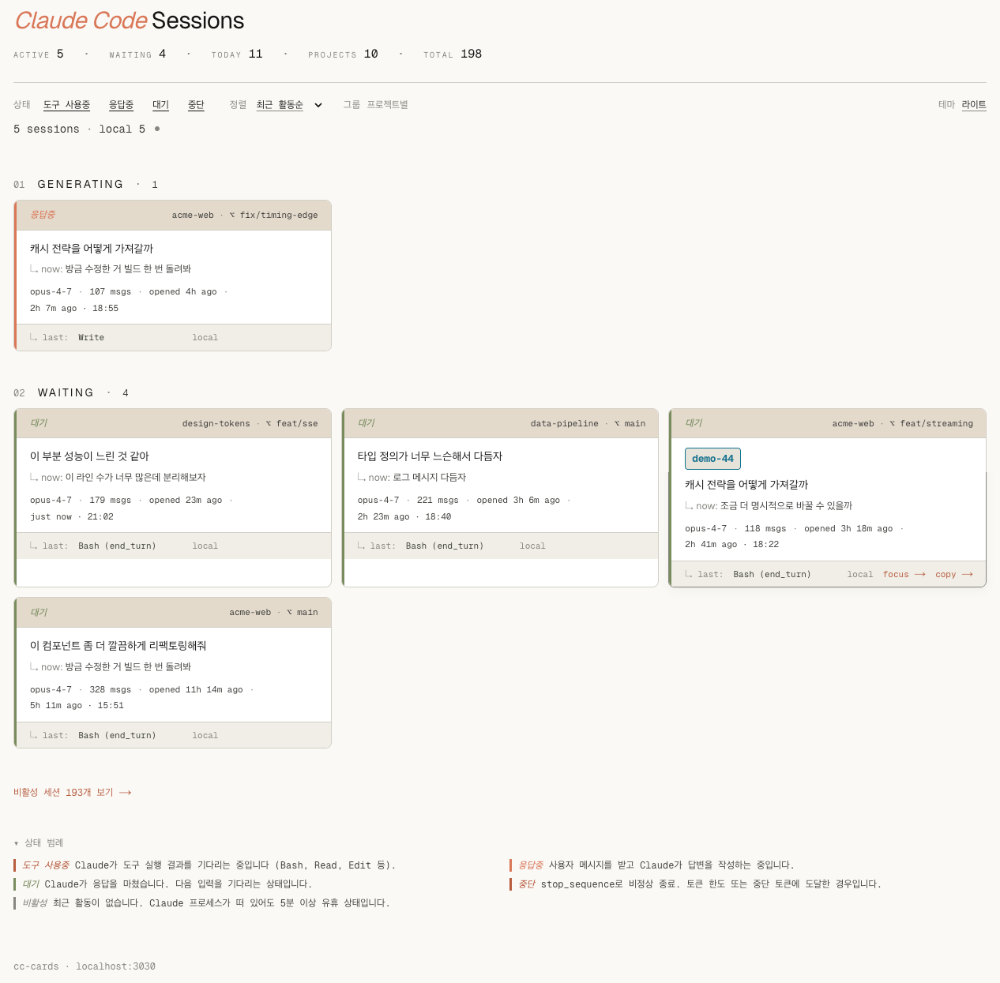

# cc-cards

**English** · [한국어](./README.ko.md)

> A card-based local monitor for active Claude Code sessions across `~/.claude` and `~/.ccs/instances/*`.

`cc-cards` is a single-page Next.js app that runs on `localhost:3030` and surfaces every Claude Code session you have on this machine — local and any `ccs` instance — as a single, scannable grid of editorial cards.

It tells you, at a glance:

- which sessions are **doing tool work**, **generating a response**, **waiting**, or **stopped**
- what each session is about (project, branch, model, first prompt, latest prompt)
- how long each has been open and when it last moved

The cards update live via Server-Sent Events whenever any session JSONL on disk changes.

<p align="center">
  <picture>
    <source media="(prefers-color-scheme: dark)" srcset="./docs/screenshots/cc-cards-dark.png">
    <source media="(prefers-color-scheme: light)" srcset="./docs/screenshots/cc-cards-light.png">
    
  </picture>
  <br>
  <sub><em>Screenshots captured in <code>?demo=1</code> mode — all project / branch / prompt text is placeholder.</em></sub>
</p>

## Quick start

```sh
npm install
npm run dev
# open http://127.0.0.1:3030
```

The server binds to `127.0.0.1` only — it is not reachable from outside the machine.

## Features

- **Five-state classifier**, derived purely from disk state — no polling of Claude Code itself.
- **Live updates** via SSE on a `fs.watch(recursive: true)` of every projects directory.
- **Focus → terminal jump.** Click `focus →` on a card and the matching tmux pane is selected and the terminal window (Ghostty supported) is activated.
- **`/rename` integration.** A session renamed with the in-session `/rename` command surfaces as a cyan custom-title chip on its card.
- **Two-line card body.** Identity line (custom title or first prompt) plus a "↳ now:" line for the latest prompt when it differs.
- **Session detail page** with timeline, token / message stats, tool usage breakdown.
- **Archive page** for inactive sessions, kept out of the main view by default.
- **Demo (screenshot-safe) mode** — append `?demo=1` to mask project names, branches, and prompt text with deterministic placeholders.

## What it reads

| Path                                             | Treated as     |
| ------------------------------------------------ | -------------- |
| `~/.claude/projects/<encoded>/<UUID>.jsonl`      | `local`        |
| `~/.ccs/instances/<name>/projects/...`           | `ccs:<name>`   |

Each project directory's `sessions-index.json` (when present) provides cached summary / message count / first prompt. For sessions not yet indexed, `cc-cards` does a single full read of the JSONL file (bounded at 4 MB) and extracts the same fields itself.

Symlinked roots that point at the same physical directory are deduplicated by `realpath`, so a `ccs` instance whose `projects/` symlinks back to `~/.claude/projects/` does not double-count.

## Status classification

A session's status is derived from disk state:

| Status                  | Rule (summary) |
| ----------------------- | -------------- |
| **working_tool**        | Last meaningful assistant entry ended with `stop_reason: "tool_use"` and the sidecar `<UUID>/` directory is recent. |
| **working_generating**  | Most-recent entry is a user message and the JSONL is still being written. |
| **waiting**             | Last entry is an assistant message that ended (`end_turn`) and mtime is recent. |
| **stopped**             | Last assistant message ended on `stop_sequence` (token cap or stop token). |
| **inactive**            | No recent activity (default: > 30 min) regardless of the above. |

Meta entries (`last-prompt`, `permission-mode`, `attachment`, `file-history-snapshot`, `system`) are skipped when determining "last meaningful entry," so plan-mode hooks and SessionStart hooks do not confuse the classifier.

## URL state

The page reads its filter, sort, group, and demo state from the query string, so any view is bookmarkable:

| Param    | Values                                                                                                                                |
| -------- | ------------------------------------------------------------------------------------------------------------------------------------- |
| `status` | Comma-separated subset of `working_tool`, `working_generating`, `waiting`, `stopped`, `inactive`                                      |
| `sort`   | `activity-desc` (default), `activity-asc`, `opened-desc`, `opened-asc`                                                                |
| `group`  | `project` to group cards by project (`cwd` basename); omit for default grouping by status                                             |
| `demo`   | `1` to enter demo / screenshot-safe mode (mask project / branch / prompts with deterministic placeholders, disable the SSE overlay)   |

Examples:

- `/?status=working_tool,working_generating,waiting` — hide stopped and inactive
- `/?group=project&sort=opened-desc` — newest sessions first, grouped by project
- `/?demo=1` — masked view for safe screenshots
- `/archive?demo=1` — masked archive view

## Demo / screenshot-safe mode

Cards normally show your real `cwd`, branch, and prompt text. To capture a screenshot for a README or blog post, append `?demo=1`:

- Project names, git branches, first / last prompts, custom titles, and JSONL paths are replaced with stable placeholders derived from each session's id (so the same card always shows the same fake content).
- The SSE overlay is disabled in this mode so the placeholders are not overwritten by a live patch.
- A small "DEMO MODE" banner sits above the header with a "turn off →" link.

## Focus → terminal

Each card has a `focus →` button that jumps the user's terminal to the matching session:

1. Find the `claude` process whose `cwd` matches the card's project path.
2. Walk that PID's ancestor chain and match it to a tmux pane (`tmux list-panes -a` includes PIDs).
3. Run `tmux select-window` + `tmux select-pane` to jump.
4. Activate the terminal app (Ghostty) via AppleScript so the tmux pane is on screen.

If the session is not actually running inside tmux, the API responds with `ok: false` and a reason instead of guessing.

## Project layout

```
app/
├── layout.tsx
├── page.tsx                      # live (active) sessions
├── globals.css                   # editorial light/dark tokens
├── archive/page.tsx              # all sessions including inactive
├── session/[id]/page.tsx         # per-session detail + timeline
└── api/
    ├── sessions/route.ts         # one-shot JSON snapshot
    ├── stream/route.ts           # SSE: initial snapshot + live re-emits
    └── focus/[id]/route.ts       # tmux + Ghostty jump

components/
├── filter-bar.tsx                # URL-query-backed filter / sort / group
├── live-session-list.tsx         # client overlay; owns EventSource state
├── session-card.tsx              # 3-section card (header / body / footer)
├── header-metrics.tsx            # ACTIVE / WAITING / TODAY / PROJECTS / TOTAL row
├── timeline-view.tsx             # detail-page timeline (user / assistant / tool)
├── markdown-view.tsx             # safe markdown rendering for prompts
├── demo-banner.tsx               # ?demo=1 indicator + turn-off link
├── legend.tsx                    # collapsible status legend
├── section-header.tsx
├── theme-toggle.tsx
└── copy-paths.tsx                # delegated click → copy JSONL path

lib/
├── sources.ts                    # discover ~/.claude + ~/.ccs/instances/*
├── scanner.ts                    # enumerate <UUID>.jsonl + sidecar detection
├── parser.ts                     # sessions-index.json + tail-or-full parse
├── state.ts                      # status classifier + labels
├── liveness.ts                   # PID → cwd map (lsof) for live-process matching
├── focus.ts                      # claude PID → tmux pane → Ghostty activate
├── detail.ts                     # full JSONL → timeline + per-session stats
├── grouping.ts                   # filter / sort / group (pure)
├── snapshot.ts                   # discover → scan → parse → classify
├── watcher.ts                    # fs.watch(recursive) with 200 ms debounce
├── metrics.ts                    # header metric row
├── masking.ts                    # demo-mode deterministic placeholders
├── account.ts                    # local git config / username (display only)
├── format.ts                     # relative-time / compact-number helpers
└── types.ts
```

## Live update flow

```
Browser ──GET /api/stream──> Next.js (node runtime)
                              │
                              ├─ initial "snapshot" push
                              │
                              └─ fs.watch(<projects>, recursive=true)
                                    │  debounce 200 ms
                                    ▼
                              buildSnapshot()   (parser cache keyed by mtime)
                                    │
                                    └─ "snapshot" or "patch" push
                              ──── heartbeat ":hb <ts>\n\n" every 25 s ────
```

`live-session-list.tsx` applies each `patch` (upsert / remove) in place and re-renders. Filter / sort / group are pure-client and react immediately. In demo mode, the EventSource is not opened — the initial server render is kept as-is.

## Requirements

- **macOS or Windows.** `fs.watch(..., { recursive: true })` has no portable Linux equivalent. PRs welcome.
- **Node.js 20+** (Next.js 16 requirement).
- **Optional but recommended for focus-jump:** tmux + a supported terminal (currently Ghostty AppleScript activation).

## Caveats

- **Localhost-only by design.** The dev server binds to `127.0.0.1`. Do not expose the port to a network without first reviewing prompt redaction — your messages can contain secrets.
- **Public-screenshot hazard.** Cards show your real `cwd`, branch, and prompt text. Use `?demo=1` before publishing any screenshot.
- **Large JSONLs (> 4 MB)** fall back to tail-only parsing; `firstPrompt` may be absent for those when not yet in `sessions-index.json`.
- **Status classification is heuristic.** It infers state from disk, not from Claude Code's process. A killed `claude` process can leave a "working" card behind until the inactivity timer flips it.

## License

MIT — see `LICENSE`.
